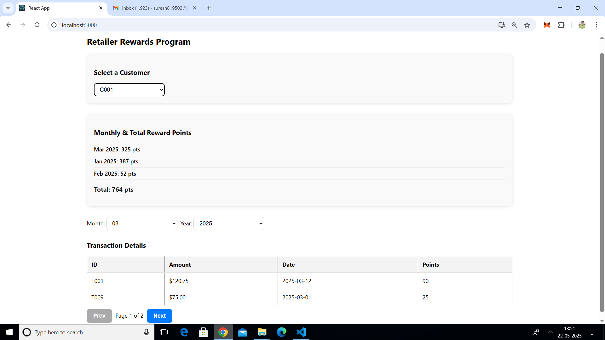
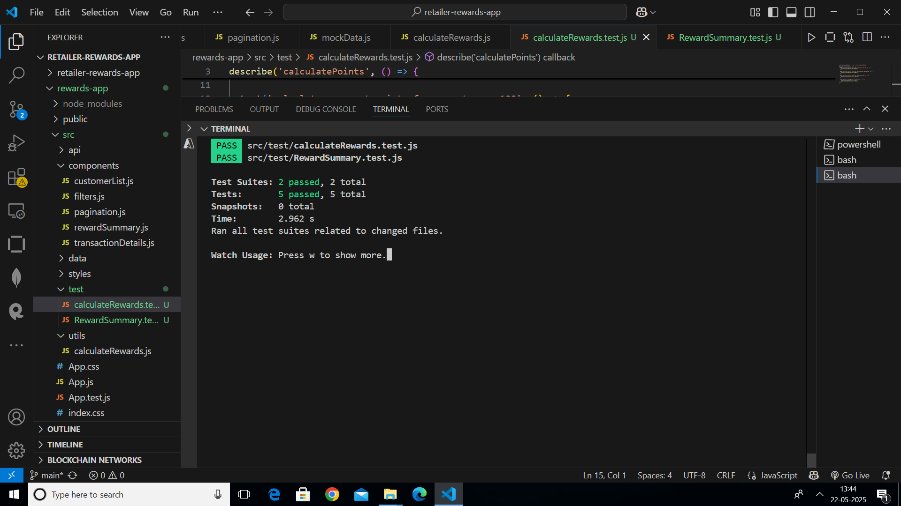

# Retailer Rewards Program

## Project Overview

This React application calculates reward points for customers based on their transactions over a three-month period. The reward system awards:
- **2 points** for every dollar spent over $100 per transaction
- **1 point** for every dollar spent between $50 and $100 per transaction

Example:  
A $120 purchase yields: 2 × $20 + 1 × $50 = **90 points**

---
## Screenshots

### Application UI


### Test Case Success

## Features

- Simulated asynchronous API call to fetch transaction data with loading and error handling
- Displays all customers by default with their monthly and total reward points
- Filterable by customer, month, and year with dropdowns for last 3 months by default
- Transaction details and reward points for selected customer and month
- Pagination for handling large transaction data sets
- Responsive UI styled with Styled Components
- Prop validations to ensure component integrity
- Unit tests with positive and negative cases (whole numbers and fractions)
- Transaction logging for debugging and audit
- Clean folder structure and code splitting for scalability

---

## Getting Started

### Prerequisites

- Node.js (>= 14.x recommended)
- npm or yarn package manager

### Installation

1. Clone the repo

```bash
git clone https://github.com/Sureshp509/retail-rewards-app.git
cd rewards-app
